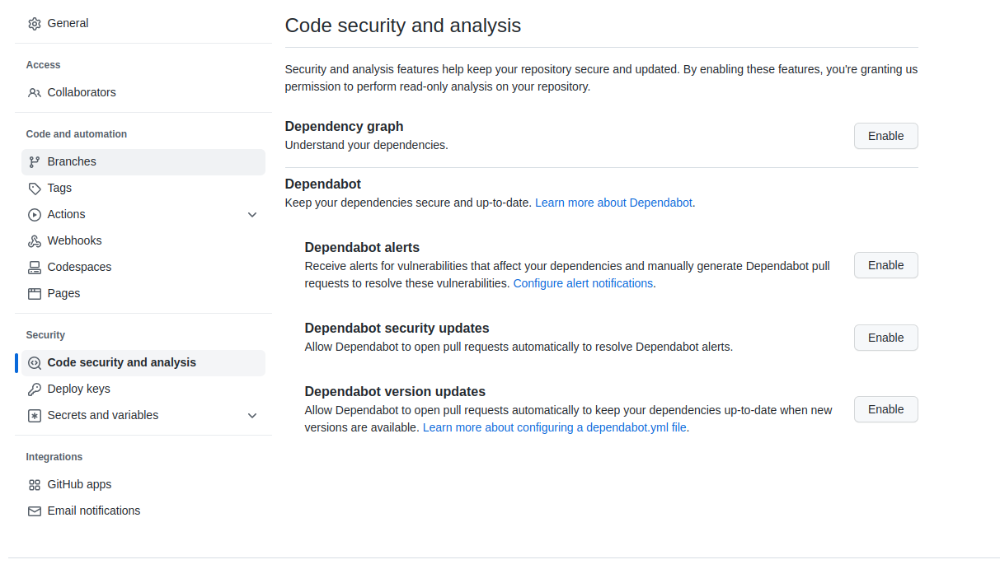
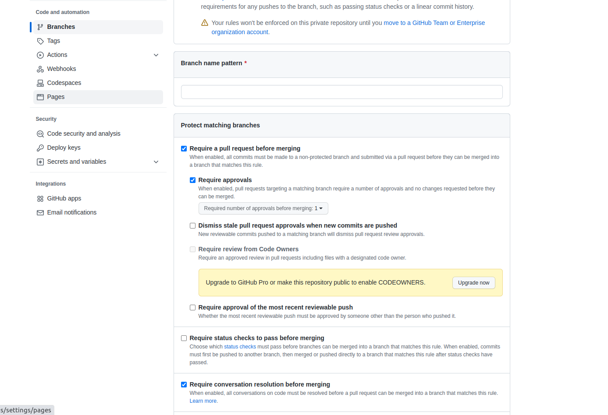
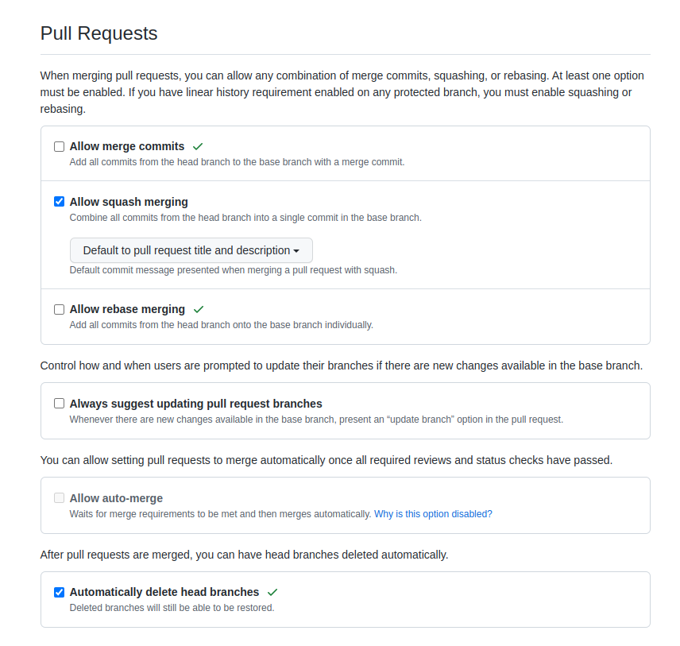

# Píldora Educativa para Pull Requests en GitHub

En esta píldora educativa, aprenderás los conceptos básicos sobre cómo crear un Pull Request en GitHub, cómo utilizar templates para la Pull Request, cómo utilizar Conventional Commits y cómo proteger tu repositorio en GitHub.

## Contenido

1. [Crear un Pull Request](#crear-un-pull-request)
2. [Template para la Pull Request](#template-para-la-pull-request)
3. [Conventional Commits](#conventional-commits)
4. [Proteger el repositorio GitHub](#proteger-el-repositorio-github)

## Crear un Pull Request

Una Pull Request es una solicitud para fusionar un conjunto de cambios en una rama de Git. Aquí te presentamos los pasos básicos para crear una Pull Request:

1. Haz un fork del repositorio que quieres contribuir.
2. Clona el repositorio a tu computadora local.
3. Crea una rama para trabajar en tu contribución.
4. Haz los cambios necesarios y realiza los commits.
5. Empuja los cambios a tu repositorio en GitHub.
6. Crea una Pull Request para fusionar tus cambios en el repositorio original.

## Template para la Pull Request

Los templates para la Pull Request te permiten crear una guía para los colaboradores sobre cómo crear una Pull Request. Aquí te mostramos cómo crear un template para la Pull Request:

1. Crea un archivo `pull_request_template.md` en la carpeta `.github` de tu repositorio.
2. Agrega las secciones que quieres incluir en el template.
3. Guarda el archivo y pruébalo.

## Conventional Commits

Conventional Commits es una especificación para escribir mensajes de commit en Git de una manera estructurada. Utilizando esta convención, los mensajes de commit pueden ser analizados automáticamente y se pueden generar automáticamente versiones y etiquetas de Git. Esto ayuda a mantener un historial de cambios más organizado y coherente.

Un mensaje de commit convencional se compone de tres partes principales:

1. **Tipo:** describe el propósito del cambio, como `feat` para nuevas características, `fix` para corrección de errores, `docs` para cambios en la documentación, `style` para cambios en el formato, etc.

2. **Alcance (opcional):** describe el ámbito del cambio, es decir, la sección o componente del código que se ha modificado.

3. **Breve descripción:** resume el cambio en una frase corta y clara.

Por ejemplo, un mensaje de commit convencional para una nueva característica que se ha añadido al componente de autenticación del código podría ser:

Algunas de las ventajas de utilizar Conventional Commits son:

- **Automatización:** la estructura predefinida de los mensajes de commit convencionales permite a las herramientas de desarrollo automatizar algunas tareas, como la generación de versiones y etiquetas de Git.

- **Lectura más clara y rápida:** al seguir una estructura común, los mensajes de commit se vuelven más legibles y fáciles de entender para los desarrolladores.

- **Mejor historial de cambios:** los mensajes de commit más organizados permiten una mejor comprensión del historial de cambios en el código, lo que puede ayudar a los desarrolladores a encontrar errores y entender por qué se realizaron ciertos cambios.

En resumen, utilizar Conventional Commits puede ser una práctica muy útil para mantener un historial de cambios más organizado y fácil de seguir en un proyecto de desarrollo.

https://www.conventionalcommits.org/en/v1.0.0/#summary

## Proteger el repositorio GitHub

Es importante proteger el repositorio para evitar problemas de seguridad o malas prácticas de codificación. Aquí te presentamos algunos consejos para proteger tu repositorio GitHub:

### 1. Configurar

Lo primero que debes hacer es configurar las opciones de seguridad del repositorio. Para ello, debes ir a la pestaña "Settings" y seleccionar la opción "Security & analysis".

### 2. Configurar las opciones de seguridad

Una vez en la sección de "Security & analysis", deberás configurar las opciones de seguridad adecuadas para tu proyecto. Aquí te presentamos algunas opciones que puedes utilizar:

- **Code scanning**: activa la opción de escaneo de código para buscar vulnerabilidades y errores en el código.
- **Dependency graph**: habilita el gráfico de dependencias para que puedas ver las dependencias de tu proyecto y detectar posibles vulnerabilidades.
- **Secrets**: utiliza la función de secrets para almacenar claves de acceso y otros datos sensibles.

### 3. Configurar los permisos de colaboradores

Es importante que configures los permisos de los colaboradores adecuadamente para evitar que se produzcan cambios no autorizados en el repositorio. Puedes asignar diferentes permisos a cada colaborador según su rol en el proyecto.

### 4. Configurar las restricciones de rama

Puedes configurar las restricciones de rama para evitar que se realicen cambios no autorizados en la rama principal del proyecto. Esto puede ayudar a evitar problemas de seguridad y garantizar que el código esté siempre actualizado y funcione correctamente.

¡Recuerda siempre mantener actualizadas las opciones de seguridad de tu repositorio y estar al tanto de las mejores prácticas para garantizar un código seguro y protegido! 

### 5. Configurar las Pull Request

Podemos configurar como se hace merge por defecto de las PR en el apartado "Settings" -> "General" -> "Pull Request"

## GitHub Actions

GitHub Actions es un sistema de automatización de tareas que se integra directamente con GitHub. Permite ejecutar flujos de trabajo automatizados en respuesta a eventos específicos en un repositorio de GitHub, como la creación de una solicitud de extracción (pull request) o la publicación de una nueva versión.

Los flujos de trabajo de GitHub Actions se definen en archivos YAML, lo que los hace altamente configurables y portátiles. Los flujos de trabajo pueden incluir múltiples pasos, como la compilación de código, la ejecución de pruebas, el despliegue a servidores remotos, entre otros.

GitHub Actions viene con una amplia variedad de acciones predefinidas que se pueden usar directamente en los flujos de trabajo. También es posible crear acciones personalizadas para automatizar tareas específicas.

Hay que activar las actions desde la pestaña "actions" del repositorio.

